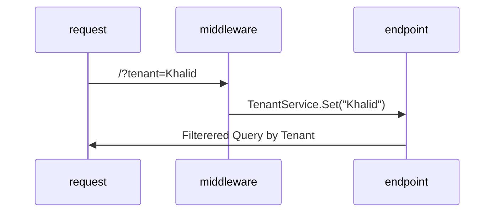

# ASP.NET Core Minimal APIs and Multi-tenancy

This example shows how you can use EF Core and ASP.NET Core to
build multi-tenancy mechanisms into your web applications.

The general flow of the application:



We are utilizing EF Core Query Filters, but they are optional.

```c#
    public Database(DbContextOptions<Database> options, ITenantService tenantService)
        : base(options)
    {
        tenant = tenantService.Tenant;
    }

    protected override void OnModelCreating(ModelBuilder modelBuilder)
    {
        modelBuilder
            .Entity<Animal>()
            .HasQueryFilter(a => a.Tenant == tenant)
            .HasData(
                new() {Id = 1, Kind = "Dog", Name = "Samson", Tenant = "Khalid"},
                new() {Id = 2, Kind = "Dog", Name = "Guiness", Tenant = "Khalid"},
                new() {Id = 3, Kind = "Cat", Name = "Grumpy Cat", Tenant = "Internet"},
                new() {Id = 4, Kind = "Cat", Name = "Mr. Bigglesworth", Tenant = "Internet"}
            );
    }
```

Have fun.

## Note

This is using .NET 7 and EF Core 7 bits, but should work with .NET 6 and EF Core 6.